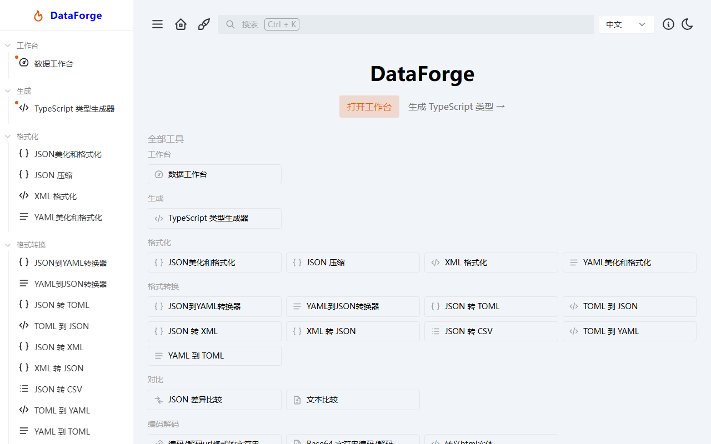
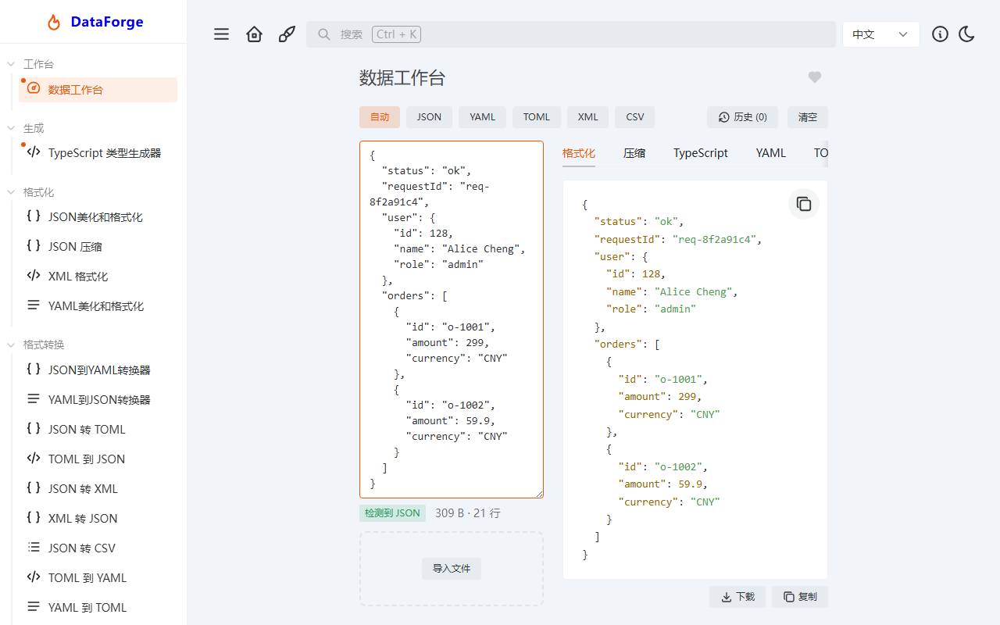
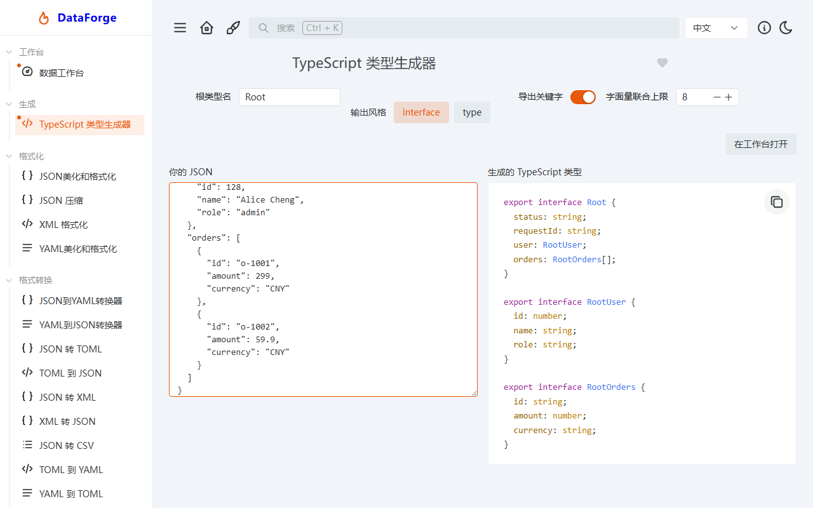

<p align="center">
  <strong>DataForge</strong> · 前端开发者数据工作台
</p>

<p align="center">
把一份混乱的数据，格式化、对比、转换格式、生成 TypeScript 类型——一站式完成。<br />
<em>Paste once, use everywhere.</em>
</p>

<p align="center">
  <a href="https://dataforge.autopoet.cn/"><strong>Live Demo</strong></a>
</p>

---

## 截图

<p align="center">
  
  
  
</p>

## 这个项目解决什么问题

前端开发者在联调、排查、写配置时，高频地做这些事：把乱糟糟的 JSON 格式化、压缩、对比两次返回、在 JSON / YAML / TOML / XML / CSV 之间转换、把接口返回变成 TypeScript 类型。目前这些操作分散在多个在线站点，数据要来回复制粘贴。

DataForge 把这些能力收敛到一个产品里：**一个数据工作台，围绕同一份数据提供多种处理视图**（格式化 / 压缩 / 类型生成 / 多格式转换 / CSV 导出），并附带少量专项工具页。工作台与专项页之间通过 handoff 机制无缝接续：工作台的 TypeScript 视图可以把当前数据一键带给类型生成器，类型生成器、对比、各转换页、文本对比也能把数据带回工作台继续处理——同一份数据，多个入口。

> 本项目基于开源项目 [IT-Tools](https://github.com/CorentinTh/it-tools)（GPL-3.0）二次开发：保留其 Vue 3 / TypeScript / Vite / Naive UI 工程底座，围绕"数据处理"重新组织产品，并新增了数据工作台、快照对比、JSON → TypeScript 类型生成等能力。

## 功能一览

- **数据工作台**：格式自动检测、多层编码 JSON 一键解码、格式化 / 压缩 / 转换（YAML / TOML / XML / CSV）、TypeScript 类型视图、文件导入导出（>1MB 确认 / >10MB 拒绝）、每个视图独立复制 / 下载、历史快照与对比（自动防抖快照，可恢复、可 Diff）
- **TypeScript 类型生成器**：从 JSON 推导嵌套 interface / type 声明（可选字段、字面量联合、数组元素键并集、命名冲突处理）
- **数据格式化**：JSON 格式化（缩进 / 键排序 / 校验）、JSON 压缩、XML 格式化、YAML 格式化
- **格式转换**：JSON ↔ YAML / TOML / XML、JSON → CSV（嵌套 flatten）、TOML ↔ YAML
- **对比**：JSON Diff（自研 diff-viewer 树形差异渲染）、文本 Diff（Monaco 差异编辑器，实时输入，输入持久化）
- **编码解码**：URL 编码、Base64 字符串、HTML 实体
- **联调参考**：JWT 解析、HTTP 状态码

## 架构

所有视图不直接消费原始文本，而是经过统一的「解析 → JS 值（IR）→ 序列化」管线：

```
rawInput ──检测 / 手动指定──▶ detectFormat ──▶ parseToData ──▶ IR（纯 JSON 兼容 JS 值）
                                ▲                  (M1 / M2, 纯函数 + 单测)
                                │
                                └─ 是多层编码 JSON? ─▶ DecodeBanner 逐层解码 ─▶ 写回 IR

IR ──▶ 视图注册表 ViewRegistry ──▶ 激活视图 render ──▶ 复制 / 下载（每个视图独立）
        ├─ formatted   （按输入格式美化）
        ├─ minified
        ├─ typescript
        ├─ yaml / toml / xml
        └─ csv

rawInput 变化 ──2s 防抖──▶ pushSnapshot ──▶ snapshots[]（≤50 条，>512KB 截断）
                                                  │
                                                  ▼
                                        与当前输入 Diff（复用自研 diff-viewer）
```

关键设计点：

- **IR 是纯 JSON 兼容的 JS 值**（无 Date / undefined / Symbol，TOML 的 Date 归一化为 ISO 字符串）。各格式解析后统一规范化，所有视图面对同一形状的数据。
- **视图注册表驱动**：每个输出视图是一个自描述的 descriptor，UI 从注册表渲染 Tabs——新增视图零 UI 改动，只加一个 descriptor。
- **性能约定**：输入 300ms 防抖（计算只在你停手时跑一次），视图输出 `computed` 惰性求值，大输入不卡 UI。

目录结构：

```
src/
  tools/                # 每个工具一个文件夹（index.ts 元数据 + Tool.vue + service + 测试）
    index.ts            # toolsByCategory 集中注册，路由 / 侧边栏 / 命令面板 / 收藏自动生成
    workbench/          # 数据工作台（本身也是一个注册工具，path: /workbench）
      workbench.store.ts# 状态 + 快照 + localStorage 持久化（2s 防抖 / 去重 / 配额降级）
      components/       # InputPanel / OutputViews / ViewToolbar / DecodeBanner
                        # FileDropZone / HistoryTimeline / SnapshotDiffModal
      services/         # format-detect / deep-decode / convert / csv（纯函数 + 单测）
      views/            # 视图注册表 registry.ts + 6 个 view 描述符
    type-generator/     # JSON → TypeScript（service + 页面 + 单测）
  ui/                   # 自研 c-* 组件库（含暗 / 亮主题）
  composable/           # 共享组合式函数（useValidation / useCopy / useStorage 持久化 / downloadTextFile 等）
  modules/              # 命令面板（Ctrl+K 搜索）、i18n、tracker
  stores/               # Pinia：tools（收藏）、style（主题）
  layouts/              # base 布局 + tool 布局
  pages/                # 首页 / 关于 / 404
locales/                # 语言字典（界面提供中文 / English，仓库保留完整语言包）
```

## 技术栈

Vue 3.3 · TypeScript · Vite 4 · Pinia · Vue Router 4 · Naive UI · UnoCSS · vue-i18n · Vitest · Playwright · PWA

## 快速开始

```sh
pnpm install
pnpm dev          # 本地开发（http://localhost:5173）
pnpm typecheck    # 类型检查（vue-tsc）
pnpm build        # 类型检查 + 生产构建
CI=true pnpm test:unit  # 单元测试
pnpm test:e2e     # 端到端测试（Playwright）
pnpm lint         # ESLint
```

Windows 注意项：

- `CI=true pnpm test:unit` 否则 vitest 进入 watch 模式会挂起；windows 下 `pnpm build` 已直接可用（无需额外环境变量）。
- e2e 需要本机 Playwright 浏览器；官方 CDN 直连慢时用镜像安装：`PLAYWRIGHT_DOWNLOAD_HOST=https://cdn.npmmirror.com/binaries/playwright npx playwright install chromium`。

## 测试

- **单元测试**：19 个文件 / 235 用例全绿——数据处理管线是纯函数 service，测试就近放置（format-detect 31 / convert 30 / csv 22 / type-generator 31 / workbench.store 26 / views 31 等）；store 类测试运行在 jsdom 环境。
- **端到端测试**：40 用例（chromium 全绿）——覆盖首页 Hero、工作台全流程（脏 JSON → 徽章 → 格式化 / 视图转换 / 多层解码 / 下载）、历史快照（恢复 / 对比 / 清空）、类型生成器、各转换页。
- **CI**：两个工作流自动运行——`ci.yml`（install → lint → test:unit → typecheck → build）与 `e2e-tests.yml`（chromium / firefox / webkit 三 shard）。

## 性能

DataForge 围绕"检测 → 解析 → IR → 序列化"的中间表示（IR）管线设计。计算层在任何输入规模下都很快；可见的成本集中在大输出视图的语法高亮渲染。

| 输入规模 | 体验 | 防护 |
|---|---|---|
| ≤ 1 MB | 全功能流畅（计算 <400ms，视图渲染即时） | 300ms 输入防抖 + computed 惰性 + 视图按需渲染 |
| 1–5 MB | 计算可用；大输出视图渲染秒级（~10s，highlight.js + n-code 高亮为瓶颈） | 文件导入 >1MB 二次确认；建议使用小输出视图（如 TS 类型） |
| > 5 MB | 大输出视图有渲染进程崩溃风险 | 文件导入 >10MB 直接拒绝；粘贴无护栏（声明的产品边界） |
| 快照 | 单条 >512KB 截断、上限 50 条、配额降级 | 独立 localStorage 键 + QuotaExceeded 裁剪 |

实测（2026-08-17，1MB 输入）：工作台计算层 <400ms，而 1MB 格式化视图在普通 Chromium 上渲染约 9–10s——渲染比计算慢约 20–25×。线上 Demo 跑的是同一构建。

值得一读的延迟工程点：**输入防抖**——打字时不会触发解析，300ms 停顿后整批工作才跑一次（1MB 时检测 + 解析 <400ms），而不是每敲一个键跑一遍；**视图惰性渲染**——`computed` 延迟求值，且只有激活的 Tab 会调用 `render`，所以 5MB 输入可以停在便宜的 TypeScript 视图里，根本不会碰重的输出视图；**导入护栏**——文件导入按大小分级（>1MB 确认 / >10MB 拒绝），在源头拦住最坏情况。

## 二次开发（新增一个工具）

新增工具只需两步：

1. 建 `src/tools/<name>/` 目录，`index.ts` 用 `defineTool` 声明 name / path / icon / 懒加载组件（懒加载 = 打包自动 code-split）；
2. 把工具加进 `src/tools/index.ts` 的 `toolsByCategory`。

路由、侧边栏、命令面板（Ctrl+K）、收藏会自动生成，无需改 `src/router.ts`。

约定：处理逻辑抽成纯函数 service + Vitest 单测（数据工具模式），UI 壳复用 `src/ui/` 的 c-* 组件（c-input-text / c-select / c-button / c-tooltip…）与 `src/composable/`（useStorage 持久化、useCopy、useValidation 等）。完整需求文档仅保存在本地（`docs/` 已被 .gitignore 排除），不随仓库分发。

## 部署

纯前端静态应用，已内置三套部署配置：

- **Vercel**：`vercel.json`（SPA 重写），推送 GitHub 自动构建（线上地址：<https://dataforge.autopoet.cn/>）
- **Netlify**：`netlify.toml`
- **Docker**：`Dockerfile` + `nginx.conf`

## 许可

[GNU GPLv3](LICENSE)。本项目基于开源项目 [IT-Tools](https://github.com/CorentinTh/it-tools) 二次开发，保留上游署名与 GPL-3.0 许可义务。
